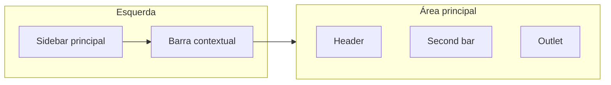

# Plano unificado: frontend inovador — sidebar, header, barra contextual e permissões

Este plano funde o **primeiro plano** (sidebar agrupada, header organizado, refinamentos visuais) com o **segundo plano** (navegação por papel, barra contextual por módulo, permissões e documentação).

---

## Parte A — Do primeiro plano: estrutura visual base

### A.1 Sidebar principal (agrupada e colapsável)

- **Grupos de navegação** (quando expandida): Principal | Pedagógico | Cadastros | Finanças | Sistema.
- **Títulos de secção** quando a sidebar está expandida: texto pequeno, cor `studio-sidebar-muted`, margem para separar grupos.
- **Colapsada**: só ícones; sem títulos de grupo; expansão no hover (transição + sombra); estado guardado em `localStorage`.
- **Zona inferior**: papel do utilizador, botão Sair, botão Expandir (quando colapsada).

### A.2 Header (cabeçalho planeado)

- **Esquerda:** logo pequeno (link para `/`) + separador vertical + breadcrumbs (derivados de `location.pathname` + `SEGMENT_LABELS`).
- **Centro:** espaço flex (opcional título de página no futuro).
- **Direita:** notificações | ajuda | tema (claro/escuro) | menu utilizador (papel + dropdown com "Terminar sessão"). Agrupar ícones com espaçamento consistente; botão do utilizador ligeiramente destacado.
- Altura fixa (ex.: `h-14`), alinhamento vertical central; fechar dropdowns com Escape e clique fora.

### A.3 Second bar (tabs contextuais)

- Manter [secondBarConfig.ts](gestao-escolar/src/layout/secondBarConfig.ts) e a barra horizontal de tabs por rota (Lista | Adicionar, etc.).
- Alinhar padding/borda com o header para coerência visual.

### A.4 Refinamentos visuais

- Transição suave ao expandir/recolher a sidebar (incluindo aparecer/desaparecer títulos de grupo).
- Focus visível em botões e links: `focus-visible:ring-2 focus-visible:ring-studio-brand` (ou equivalente já usado).
- Usar apenas variáveis e cores existentes (`studio-*`, `gibbon-*`); sem novo design system.

---

## Parte B — Do segundo plano: papel, barra contextual e permissões

### B.1 Sidebar filtrada por papel

- Cada item da sidebar pertence a um grupo e tem **roles** (array de papéis que podem ver).
- **Função:** `getSidebarGroupsForRole(papel)` devolve apenas grupos que tenham pelo menos um item visível para esse papel, e em cada grupo apenas os itens cujo `roles` inclua o papel.
- **Papéis atuais:** `admin`, `direcao`, `professor`, `responsavel`, `aluno`; estrutura preparada para `financeiro`, `secretario`.

Resumo de visibilidade por papel (a materializar em [sidebarConfig.ts](gestao-escolar/src/layout/sidebarConfig.ts)):

| Papel       | Sidebar (resumo) |

|------------|------------------|

| Admin      | Tudo (Principal, Pedagógico, Cadastros, Finanças, Sistema incluindo Definições) |

| Direção    | Idem sem Definições |

| Professor  | Início, Turmas, Notas, Frequência, Boletim, Horários, Comunicados, Disciplinas |

| Aluno      | Início, Meu perfil, Meu boletim, Aulas de hoje, Horário, Comunicados |

| Responsável| Início, Meus filhos, Comunicados |

| Financeiro* | Início, Finanças (quando papel existir) |

| Secretário* | A definir (ex.: Início, Alunos, Turmas, Comunicados) |

### B.2 Barra contextual (segunda barra à esquerda)

- **Quando aparece:** só se, para a rota atual e o papel do utilizador, existirem itens definidos (função `getContextBarItems(pathname, papel)`).
- **Posição:** entre a sidebar principal e o `<main>`; largura fixa (ex.: 11rem); colapsável (só ícones) opcional.
- **Conteúdo:** links verticais (ícone + label); item ativo por `pathname` + `search`.

Exemplos por contexto (a configurar em [contextBarConfig.ts](gestao-escolar/src/layout/contextBarConfig.ts)):

- **Alunos** (admin/direcao/professor): Ver lista, Adicionar aluno, Ver boletim (em contexto de aluno), Ver perfil.
- **Início para aluno:** Meu perfil, Meu boletim, Trabalhos académicos, Aula de hoje, Horário, Comunicados.
- **Responsável:** Meus filhos, Boletim do filho, Comunicados.
- **Finanças** (admin/direcao): Visão geral, Categorias, Lançamentos, Parcelas, Relatórios, Configuração.

### B.3 Camada de permissões no frontend

- **Criar** [gestao-escolar/src/lib/permissoes.ts](gestao-escolar/src/lib/permissoes.ts): funções por papel (ex.: `canViewAlunos(papel)`, `canLancarNotas(papel)`) alinhadas ao [server/lib/escola/permissoes.ts](server/lib/escola/permissoes.ts), para esconder na UI o que o backend recusaria.

### B.4 Rotas para aluno e responsável

- Verificar [App.tsx](gestao-escolar/src/App.tsx); adicionar se faltar: `/meu-perfil`, `/meu-boletim`, `/aulas-hoje`, `/meus-filhos`. Páginas podem reutilizar componentes (ex.: Boletim com alunoId do utilizador). Não remover rotas existentes; só restringir visibilidade no menu.

---

## Arquitetura visual unificada

- **Sidebar:** agrupada (Principal, Pedagógico, Cadastros, Finanças, Sistema), filtrada por papel, colapsável.
- **Barra contextual:** condicional à rota e papel; funções do módulo (ex.: Alunos → ver boletim, perfil, etc.).
- **Header:** logo + breadcrumbs | notif + ajuda + tema + user.
- **Second bar + Content:** mantidos.

---

## Ficheiros (resumo único)

| Acção   | Ficheiro | Descrição |

|--------|----------|-----------|

| Criar   | `gestao-escolar/src/layout/sidebarConfig.ts` | Grupos (Principal, Pedagógico, Cadastros, Finanças, Sistema); por item: `to`, `label`, `icon`, `roles`. `getSidebarGroupsForRole(papel)`. |

| Criar   | `gestao-escolar/src/layout/contextBarConfig.ts` | Itens por contexto (rota) e opcionalmente `roles`. `getContextBarItems(pathname, papel)`. |

| Criar   | `gestao-escolar/src/lib/permissoes.ts` | Helpers por papel (espelho do backend para visibilidade na UI). |

| Alterar | `gestao-escolar/src/pages/Layout.tsx` | (1) Sidebar a partir de `sidebarConfig` com títulos de grupo e filtro por papel. (2) Barra contextual entre sidebar e main quando `getContextBarItems` não vazio. (3) Header com zonas esquerda/direita e refinamentos (grupo de ícones, focus). (4) Second bar e Outlet inalterados na lógica. |

| Verificar/Alterar | `gestao-escolar/src/App.tsx` | Rotas aluno/responsável (meu-perfil, meu-boletim, aulas-hoje, meus-filhos) se necessário. |

| Criar   | `docs/FRONTEND-NAVEGACAO-PERMISSOES.md` | Registo único: papéis, sidebar por grupo e por papel, barra contextual por contexto/papel, referência a permissoes (frontend + backend), como adicionar papel ou função. |

| Atualizar | `docs/INDICE-DOCUMENTACAO.md` e/ou `docs/FRONTEND-REFERENCIA.md` | Link para FRONTEND-NAVEGACAO-PERMISSOES.md. |

---

## Ordem de implementação sugerida

1. **permissoes.ts** no frontend (baseado em papel).
2. **sidebarConfig.ts** (grupos + roles) e integração no Layout: sidebar agrupada, títulos quando expandida, filtro por `user.papel`.
3. **Header**: zonas esquerda/direita, agrupamento de ícones, acessibilidade (focus, Escape).
4. **contextBarConfig.ts** e renderização da barra contextual no Layout (1–2 contextos primeiro: Alunos, Finanças).
5. Alargar contextos (aluno, responsável, professor) e rotas/páginas se faltar.
6. **FRONTEND-NAVEGACAO-PERMISSOES.md** e atualização do índice da documentação.

---

## O que não mudar

- Backend [permissoes.ts](server/lib/escola/permissoes.ts) como autoridade para APIs.
- AuthContext e tema (variáveis existentes; sem novo design system).
- Second bar (tabs) e lógica de [secondBarConfig.ts](gestao-escolar/src/layout/secondBarConfig.ts).
- Base do projeto e regras em [docs/BASE-PROJETO-ESCOLA.md](docs/BASE-PROJETO-ESCOLA.md).

---

## Estado da implementação (concluído)

- **Parte A e B** implementadas: sidebar agrupada e filtrada por papel, header com zonas e breadcrumbs, barra contextual por contexto/papel, second bar com filtro por permissão (`secondBarPermissions.ts`).
- **Rotas** aluno/responsável presentes em App.tsx: `/meu-perfil`, `/meu-boletim`, `/aulas-hoje`, `/meus-filhos`.
- **Permissões na UI** aplicadas em todas as páginas com ações de escrita: Alunos, Turmas, Comunicados, Disciplinas, Anos letivos, Salas, Horários, Matrizes, Utilizadores, Atas, Ocorrências, Finanças (Categorias, Lançamentos, Parcelas, Configuração, Relatórios), Modulos, Presenças, Notas, Frequência, Justificativas, Recuperação, Pautas, Configuração Académica. Página Módulos com acesso reservado (mensagem "Acesso reservado") para não-admin.
- **Documentação:** [FRONTEND-NAVEGACAO-PERMISSOES.md](docs/FRONTEND-NAVEGACAO-PERMISSOES.md) regista papéis, sidebar, barra contextual, permissões e referência a `permissoes.ts`. Índice em [INDICE-DOCUMENTACAO.md](docs/INDICE-DOCUMENTACAO.md). Link "Documentação" no menu Ajuda do Layout.