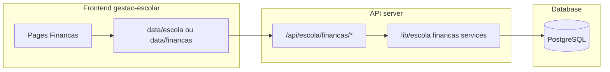

# Prompt final — Módulo de Finanças (funções avançadas e infraestrutura)

Este documento especifica o módulo de finanças com funções avançadas e **obriga** a implementação à mesma infraestrutura em 4 camadas do módulo Escola. A base de domínio está em [PROMPT-FINANCAS-REALIDADE.md](PROMPT-FINANCAS-REALIDADE.md).

---

## Referências obrigatórias

- **Domínio**: [docs/PROMPT-FINANCAS-REALIDADE.md](PROMPT-FINANCAS-REALIDADE.md)
- **Infraestrutura**: [docs/BASE-PROJETO-ESCOLA.md](BASE-PROJETO-ESCOLA.md), [docs/ANALISE-ARQUIVOS-E-FUNCOES.md](ANALISE-ARQUIVOS-E-FUNCOES.md)
- **Padrão de API**: `server/pages/api/escola/alunos/index.ts` (requireAuth, Zod safeParse, jsonSuccess/jsonError)

---

## Infraestrutura em 4 camadas (obrigatória)

| Camada | Localização | Responsabilidade |
|--------|-------------|------------------|
| 1 | `server/lib/escola/` (subpasta ou módulo finanças) | Schemas Zod, regras de negócio, serviços (sem HTTP) |
| 2 | `server/pages/api/escola/financas/` | Rotas HTTP: requireAuth, parse body com Zod, chamada a serviços |
| 3 | `gestao-escolar/src/data/escola/` (ou data/financas) | React Query: queries e mutations que consomem as APIs |
| 4 | `gestao-escolar/src/pages/` + componentes | UI: listas, formulários, relatórios (react-hook-form + zod, mesmo padrão de Alunos/Turmas) |

Resposta de erro da API: `{ error: { message: string } }`. Autenticação: JWT no header `Authorization: Bearer <token>`.

---

## Funções avançadas

### Plano de contas / categorias

- Categorias de **receita**: Mensalidade, Matrícula, Atividade extra, Evento, Outras (configuráveis por escola); ordem de exibição; ativo/inativo.
- Categorias de **despesa**: Folha, Encargos, Aluguel, Utilities, Material, Serviços, Outras; idem.
- Entidade: id, escola_id, nome, tipo ('receita' | 'despesa'), ordem, ativo.
- Todo lançamento e toda parcela ligam-se a uma categoria; relatórios agrupam por categoria.

### Mensalidades e parcelas

- Definição: valor por aluno (ou padrão por turma/ano); ano_letivo_id; número de parcelas (ex.: 12) e dia de vencimento (ex.: 10).
- Geração em lote: N alunos × M meses; cada parcela: aluno_id, responsável, valor, vencimento, categoria, status (aberta, paga, atrasada, cancelada).
- Taxa de matrícula: valor e parcelas (1 ou 2); geração no ato da matrícula ou em lote.
- Multa e juros: % multa e % juros ao mês configuráveis; valor_total_atualizado para exibição e relatórios.

### Lançamentos manuais

- **Entrada**: data, valor, categoria_id, descrição, forma_pagamento, referência, aluno_id opcional, ano_letivo_id.
- **Saída**: data, valor, categoria_id, descrição, fornecedor/beneficiário, forma_pagamento, ano_letivo_id; centro_custo opcional.
- CRUD com regra: permitir ou não editar/excluir em períodos fechados.

### Pagamentos e conciliação

- Registo: parcela_id, data_pagamento, valor_pago, forma_pagamento; atualiza status da parcela para “paga”.
- Pagamento parcial: uma parcela pode ter vários pagamentos até cobrir o valor (ou valor único por parcela).
- Relatório “previsto vs. realizado” por período.

### Inadimplência e bloqueios

- Lista de inadimplentes: filtros por ano_letivo_id, turma_id, período; aluno, responsável, parcelas em atraso, valor em aberto, dias em atraso.
- Regra de bloqueio: ex. “bloquear se parcelas_em_atraso >= 2” ou “valor_em_atraso > X”; flag por aluno/responsável; usar noutras áreas (ex.: bloquear boletim).
- Alertas: parcelas a vencer em X dias; parcelas vencidas; inclusão no dashboard.

### Dashboard financeiro

- Cards: total receitas no mês, total despesas no mês, saldo do mês; total inadimplência; número de inadimplentes.
- Gráfico ou lista: evolução receita/despesa por mês; ou top categorias de despesa.
- Lista: parcelas a vencer (próximos 7 dias); parcelas vencidas (com ação “Registrar pagamento”).

### Relatórios

- Fluxo de caixa: por período; data, descrição, entrada, saída, saldo acumulado; filtro por categoria.
- DRE simplificado: receitas e despesas por categoria; resultado no período.
- Inadimplência por turma/aluno: tabela; exportar CSV (e opcionalmente PDF).
- Previsão vs. realizado: tabela mensal previsto/realizado/diferença.

### Permissões (papéis)

- **admin, direcao**: acesso total (categorias, parcelas, lançamentos, pagamentos, relatórios, configuração).
- **Secretaria** (ou papel existente): emitir cobranças, registar pagamentos, lançar entradas/saídas, ver inadimplentes e relatórios; não alterar categorias nem regras.
- **responsavel**: apenas suas parcelas e pagamentos; segunda via; sem relatórios globais.
- Integrar com `server/lib/escola/permissoes.ts`: ex. canManageFinancas, canRegistrarPagamento, canVerPropriasParcelas.

---

## Camada 1 — lib (detalhada)

- **Schemas Zod**: categoriaFinanceira (create/update), parcela, lancamento (entrada/saída), pagamento, configuracaoFinanceira (multa, juros, regra bloqueio). Validações: valores >= 0, datas, UUIDs, escola_id.
- **Regras**: calcularMultaJuros(valor, dataVencimento, dataReferencia, config); estaInadimplente(alunoId ou responsavelId, regraBloqueio); valorTotalAtualizadoParcela(parcelaId).
- **Serviços** (sem HTTP): categorias (list, create, update, delete); parcelas (list, gerarLote, getPorAluno, getPorResponsavel); lancamentos (list, create, update, delete; filtros período/categoria); pagamentos (registar, listPorParcela); relatorios (fluxoCaixa, dreSimplificado, inadimplencia, previsaoRealizado); configuracao (get, update). Todos recebem AuthUser e usam getEscolaId(user); consultas filtradas por escola_id e ano_letivo_id quando aplicável.

---

## Camada 2 — API (rotas sugeridas)

- Base: `/api/escola/financas/`
- `GET/POST categorias`; `GET/PUT/DELETE categorias/[id]`
- `GET parcelas` (query: anoLetivoId, alunoId, responsavelId, status, dataInicio, dataFim); `POST parcelas/gerar-lote`
- `GET/POST lancamentos` (query: tipo, dataInicio, dataFim, categoriaId); `GET/PUT/DELETE lancamentos/[id]`
- `GET pagamentos` (query: parcelaId ou alunoId); `POST pagamentos` (body: parcelaId, dataPagamento, valor, formaPagamento)
- `GET relatorios/fluxo-caixa`, `GET relatorios/inadimplencia`, `GET relatorios/previsao-realizado`, `GET relatorios/dre`
- `GET configuracao`; `PUT configuracao`
- `GET minhas-parcelas` (papel responsavel)

Padrão: requireAuth; body com schema.safeParse; serviço; jsonSuccess/jsonError.

---

## Camada 3 — Data (frontend)

- Queries: useCategoriasFinancas, useParcelas(filtros), useMinhasParcelas, useLancamentos(filtros), usePagamentos(parcelaId), useDashboardFinancas, useRelatorioFluxoCaixa, useRelatorioInadimplencia, useConfiguracaoFinancas.
- Mutations: useCreateCategoria, useUpdateCategoria, useDeleteCategoria, useGerarParcelas, useCreateLancamento, useUpdateLancamento, useDeleteLancamento, useRegistrarPagamento, useUpdateConfiguracaoFinancas.
- Mesmo padrão de data/escola: api.get/post/put/delete, ESCOLA_API (ou FINANCAS_API), Authorization, cache keys consistentes.

---

## Camada 4 — UI (frontend)

- Páginas: Finanças (dashboard), Categorias, Parcelas, Lançamentos, Pagamentos, Inadimplência, Relatórios (ou abas).
- Componentes: formulários react-hook-form + zod (CategoriaForm, LancamentoForm, PagamentoForm, ConfiguracaoForm); tabelas com filtros; cards dashboard; modal/sheet para pagamento e segunda via.
- Menu “Finanças” e submenus conforme papel; botões condicionados a permissões.
- Estilo: Cards, Tables, Sheets, EmptyState, PageHeader, skeletons (conforme studio-ui e gestao-escolar).

---

## Base de dados

- **Migração**: `server/migrations/003_financas.sql`
- **Tabelas**: categorias_financeiras (id, escola_id, nome, tipo, ordem, ativo); parcelas (id, escola_id, ano_letivo_id, aluno_id, responsavel_id, categoria_id, valor_original, valor_atualizado, vencimento, status, descricao, created_at); lancamentos (id, escola_id, ano_letivo_id, tipo, data, valor, categoria_id, descricao, forma_pagamento, referencia, aluno_id opcional, centro_custo opcional); pagamentos (id, parcela_id, data_pagamento, valor, forma_pagamento, created_at); configuracao_financeira (escola_id PK, multa_percentual, juros_mensal_percentual, regra_bloqueio).
- Índices: escola_id, ano_letivo_id, aluno_id, responsavel_id, vencimento, status (parcelas); escola_id, data, tipo (lancamentos).

---

## Diagrama de fluxo

---

## Documentação pós-implementação

- Atualizar **docs/ANALISE-ARQUIVOS-E-FUNCOES.md** (ou anexo) com a secção “Módulo Finanças”: listagem de ficheiros e funções no mesmo estilo do módulo Escola.
